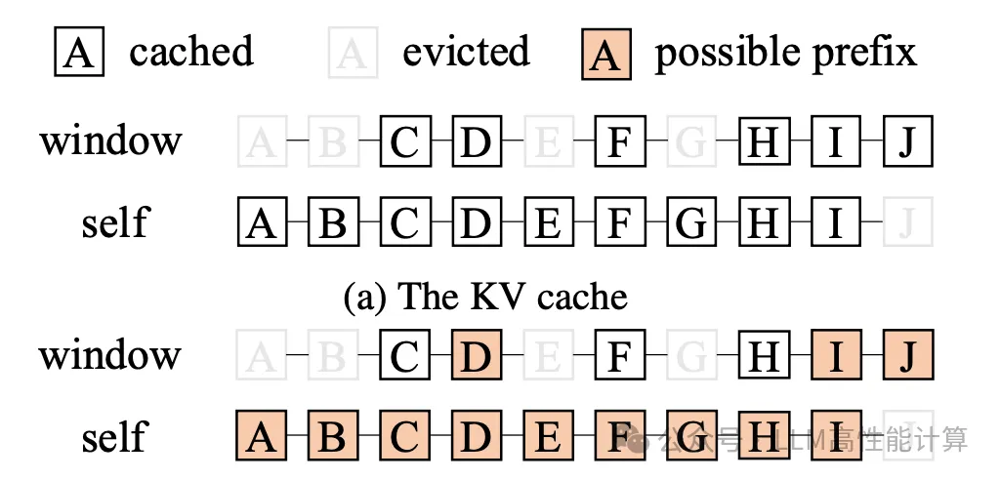
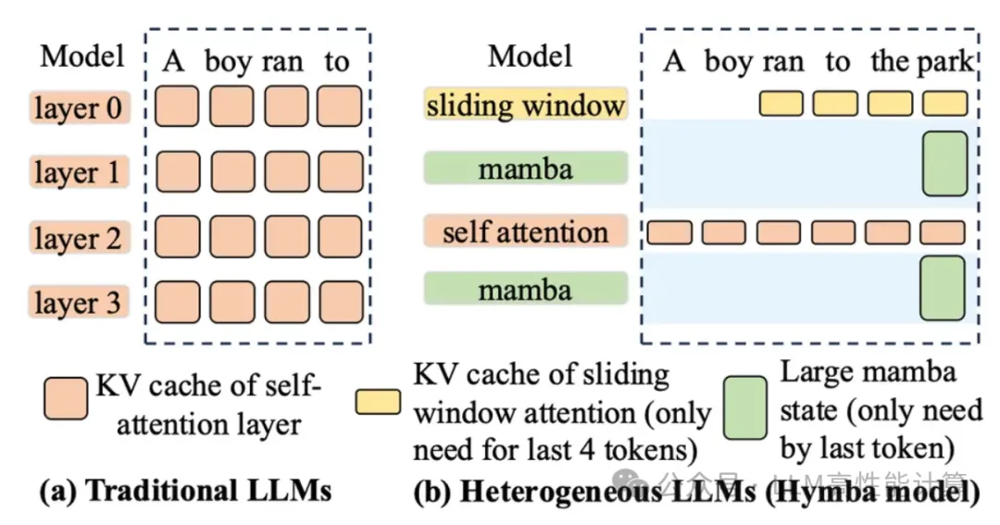
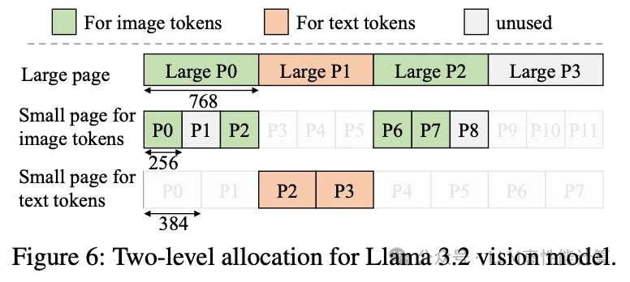
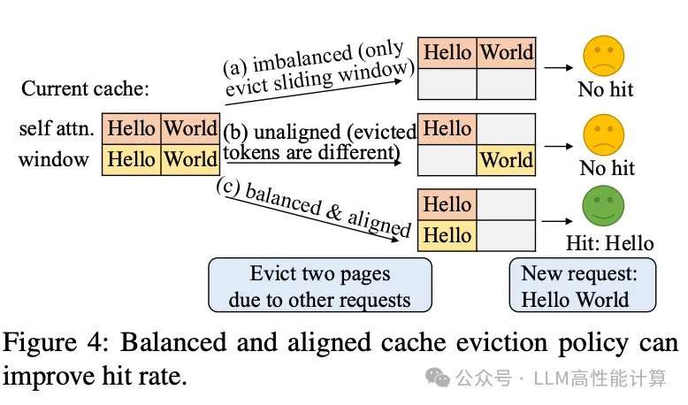
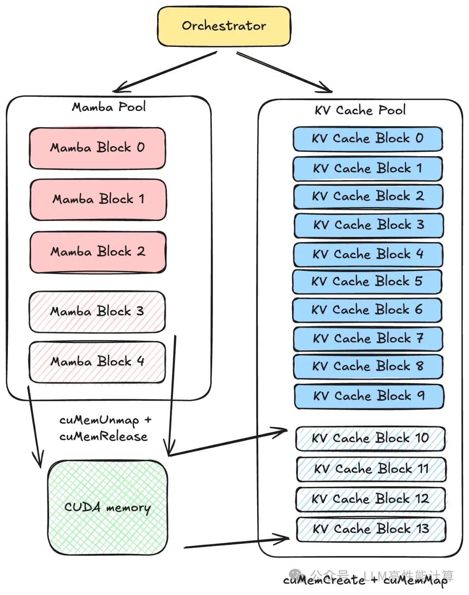
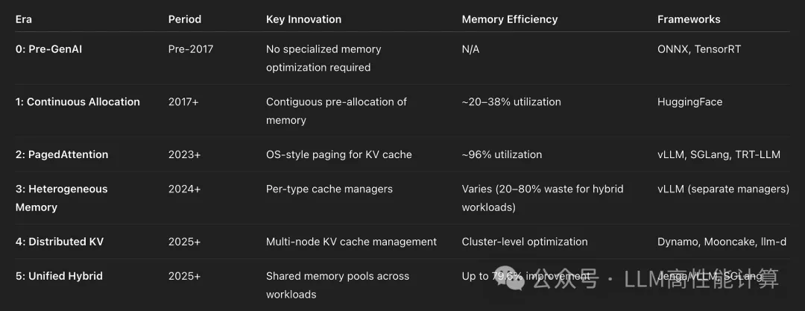

# LLM 推理 KVCache 的演进详解

## 1. 背景

在大语言模型（LLM）推理过程中，Token 的生成是自回归的——每个新 Token 的生成都需要attention机制对整个历史序列进行计算。当序列长度较长时，这种计算会成为推理的瓶颈。KVCache 通过缓存已计算过的 Key-Value 状态，避免重复计算，从而显著提升推理效率。

## 2. Multi-head Attention 详解

### 2.1 核心机制

Multi-head Attention（MHA）将输入通过多组线性变换生成 Query（Q）、Key（K）、Value（V），再将注意力分散到不同子空间：

```
MultiHead(Q, K, V) = Concat(head_1, ..., head_h) * W_O
where head_i = Attention(Q * W_Q^i, K * W_K^i, V * W_V^i)
```

### 2.2 计算量分析

标准 Attention 的计算复杂度为 O(N²) ，其中 N 为序列长度。

在推理阶段，由于需要生成大量 Token，Attention 会被反复调用。假设需要生成 T 个 Token，原生实现的计算量约为 O(NT²) 量级。KVCache 通过空间换时间的策略，将复杂度降低至 O(NT) 量级。

## 3. KVCache 原理

### 3.1 推理中的计算瓶颈

自回归推理的特点：
- 第 t 步生成时，需要计算对前 t-1 个 Token 的 Attention
- 前 t-1 步的 K、V 在每一步都会被重复使用
- 随着序列增长，重复计算的开销急剧增大

### 3.2 KVCache 的核心思想

将已计算的 K、V 缓存起来，后续生成时直接复用：

```
没有 KVCache：
  Step t: Attention(Q_t, K_[0:t], V_[0:t]) → 需要重新计算全部 K、V

有 KVCache：
  Step t: Attention(Q_t, cache_K, cache_V) → 直接使用缓存的 K、V
```

### 3.3 内存开销

每个 Token 产生的 KV 矩阵大小：
- 单层：2 * seq_len * d_head * batch_size
- 完整模型：2 * num_layers * seq_len * d_head * batch_size

以 LLaMA-7B 为例：
- 隐藏维度：4096
- 注意力头数：32
- 每 token KV 缓存大小：约 1MB

当 batch_size=1，seq_len=2048 时，单个序列的 KV 缓存即可达到 GB 量级。

## 4. 生产环境面临的挑战

### 4.1 显存容量限制

- KVCache 需要常驻显存以保证低延迟访问
- 显存总量有限，无法无限缓存
- 长上下文场景下显存压力尤为突出

### 4.2 动态内存管理

- 生成的序列长度在推理前不可知
- 不同请求的序列长度差异大
- 静态预分配会导致内存浪费或不足

### 4.3 内存碎片化

- 序列长度动态变化
- 已释放的内存难以复用
- 长时间运行后内存碎片严重

## 5. PagedAttention 与 vLLM

### 5.1 核心设计

PagedAttention 是 vLLM 提出的注意力机制，灵感来自操作系统的虚拟内存和分页管理：



```
传统方案：连续内存分配
┌─────────────────────────────────────┐
│ Block 0 │ Block 1 │ Block 2 │ ... │
└─────────────────────────────────────┘
问题：需要预分配连续空间，内存利用率低

PagedAttention：分页内存管理
┌────────┬────────┬────────┬────────┐
│ Page 0 │ Page 1 │ Page 2 │  ...   │
└────────┴────────┴────────┴────────┘
优势：按需分配，内存浪费少，可共享页面
```



### 5.2 KVCache 块管理

```
KVCache Block 结构：
- block_size: 每个块容纳的 token 数（通常为 16）
- 块状态：FREE | ALLOCATED | SWAPPED
- ref_count: 引用计数，支持 Copy-on-Write
```

### 5.3 内存共享机制

当多个序列具有相同前缀时（如 Beam Search 或共享系统提示），可以共享 KVCache 块：

```
Sequence A: [S] → [P] → [T1] → [T2]
Sequence B: [S] → [P] → [T1] → [T3]
                ↑      ↑
            共享块    共享块
```

### 5.4 性能提升

vLLM 在可比条件下相比 HuggingFace 提速最高达 24 倍，吞吐量提升最高 9 倍。

## 6. KVCache 压缩技术

### 6.1 H2O（Heavy-Hitter Oracle）



#### 核心思想

H2O 发现：Attention 分数中，只有少数" Heavy Hitter "Token 对最终输出影响显著。通过保留这些关键 Token 的 KV，丢弃其他 Token，可以大幅压缩缓存。

#### 原理

```
Attention 评分矩阵 A = softmax(Q * K^T / sqrt(d))

稀疏化策略：
1. 保留每行 top-k 的 K、V
2. 对历史 token 按累计注意力分数排序
3. 超出容量的部分按 LFU（最少使用）淘汰
```

#### 效果

在 LLaMA-7B 上，H2O 可以在保留 90% 模型性能的同时，将 KVCache 内存占用降低 50%。

### 6.2 MiniHash

#### 核心思想

使用 MinHash 技术对历史 Token 进行去重，保留具有独特表示的 Token。

#### 原理

```
1. 对每个 token 的 key 向量计算多个 hash 值
2. 保留每个 hash 桶中的最小值
3. 通过 Jaccard 相似度识别近似重复的 token
4. 保留最具代表性的 token 子集
```

### 6.3 TinyTitan



#### 核心思想

采用分层的 KVCache 管理策略，将缓存分为热、温、冷三层：

```
┌─────────────────┐
│   Hot Cache     │  ← 最近访问的 token，存于 SRAM
├─────────────────┤
│  Warm Cache     │  ← 较长上下文的 token，存于 DRAM
├─────────────────┤
│   Cold Storage  │  ← 早期 token，存于 NVMe/SSD
└─────────────────┘
```

#### 数据流动

- 新 token 优先写入 Hot Cache
- Hot Cache 满了以后向 Warm Cache 迁移
- 冷数据卸载到持久存储
- 需要时从多层存储中恢复

## 7. Prefill 阶段优化



### 7.1 Prefill 的重要性

Prefill 阶段（处理输入提示词）通常是计算密集的：

```
Prefill 阶段：
- 输入序列长度可能很长（4K、8K、128K）
- 需要一次性计算所有位置的 KV
- 计算量与序列长度平方相关

Decode 阶段：
- 输入为单个新 token
- 计算量相对较小
- KVCache 复用降低计算压力
```

### 7.2 Chunked Prefill

将长序列的 Prefill 分解为多个小块：

```
原始方案：
  Prefill(seq_len=4096) → Decode...

Chunked 方案：
  Prefill(chunk=512) → Prefill(chunk=512) → ... → Prefill(chunk=512) → Decode...
  │←─────── batched ───────→│
```

优势：
- 减少首 token 延迟
- 避免长序列导致的显存峰值
- 与 Decode 请求更好交织

### 7.3 投机解码（Speculative Decoding）

#### 核心思想

使用小模型预测多个后续 token，再用大模型验证：

```
小模型预测： [T1, T2, T3, T4, T5]
大模型验证：     [T1, T2, T3,    T5]  ← T4 被拒绝，重新采样
```

#### KVCache 利用

- 验证阶段只需计算 single token 的 Q
- 验证的 K、V 可直接复用已有 KVCache
- 接受率约 70-80% 时，收益最高

### 7.4 Flash Decoding

#### 核心思想

将长序列的注意力计算拆分，使用分治策略：

```
Flash Attention: 块级计算 + 数值稳定性优化
Flash Decoding:  在 decode 阶段使用 key 分段聚合
```

#### 原理

```
标准 Decode：
  Attention(Q_new, K_all, V_all) → O(n) 每次

Flash Decoding：
  1. 将 K、V 分段
  2. 并行计算各段的部分 attention
  3. 聚合结果
  → 可更好利用硬件并行性
```

## 8. 其他优化技术

### 8.1 Flash Attention 系列



#### Flash Attention 1.0

- IO-aware 注意力算法
- 将 O(N²) 显存复杂度降至 O(N)
- 通过分块计算和在线 softmax 技巧实现

#### Flash Attention 2

- 改进了线程束分配
- 前向传播提速 1.7 倍
- 反向传播提速 1.5 倍

#### Flash Attention 3

- 利用 Hopper 架构新特性（WGMMA）
- 理论性能可达 FP16 极限的 75-85%
- 进一步优化了工作分区

### 8.2 Ring Attention

将长序列的注意力计算分布到多个设备：

```
设备 0: 负责 token [0, n/4)
设备 1: 负责 token [n/4, n/2)
设备 2: 负责 token [n/2, 3n/4)
设备 3: 负责 token [3n/4, n)

通过环形通信聚合注意力分数
```

支持处理超长上下文（如 1M tokens）。

### 8.3 FlexGen

将 KVCache 管理扩展到多层存储层次：

```
GPU Memory  ← 最高带宽，容量最小
CPU RAM     ← 中等带宽，容量较大
NVMe/Disk  ← 带宽最低，容量最大

自动在层间迁移数据，平衡延迟和容量
```

### 8.4 量化压缩

| 方法 | 精度 | 压缩比 | 性能影响 |
|------|------|--------|----------|
| FP16 | 16-bit | 1x | 基准 |
| INT8 | 8-bit | 2x | <5% 下降 |
| INT4 | 4-bit | 4x | 10-15% 下降 |
| NF4 | 4-bit | 4x | ~5% 下降 |

## 9. 总结

KVCache 作为 LLM 推理优化的核心技术，从最初的简单缓存发展到如今的多层、多维度优化体系：

| 发展阶段 | 主要技术 | 核心收益 |
|----------|----------|----------|
| 基础 KVCache | 显存量缓存 | O(N²T) → O(NT) |
| 分页管理 | PagedAttention | 显存利用率提升，吞吐提升 9x |
| 缓存压缩 | H2O/MiniHash | 内存占用降低 50%+ |
| Prefill 优化 | Chunked/Speculative | 首 token 延迟降低 |
| 硬件适配 | Flash Attention 3 | 硬件利用率接近极限 |

未来趋势：
- 更智能的缓存淘汰策略
- 硬件感知的 KVCache 管理
- 与模型结构协同优化

---

原文：https://mp.weixin.qq.com/s/smT5OfbQSJ_pMvY4qdlC4Q
