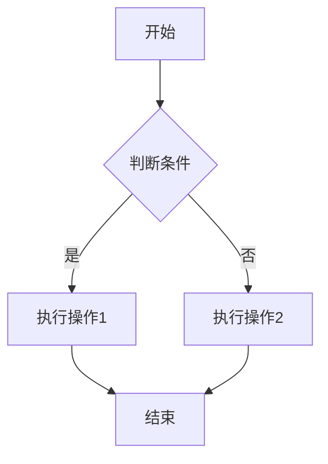
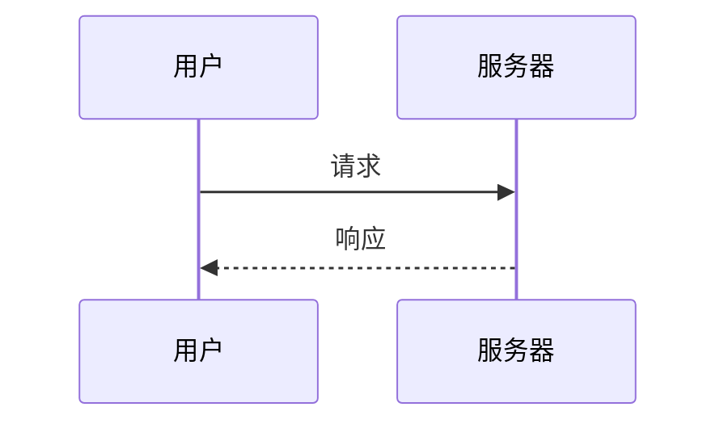
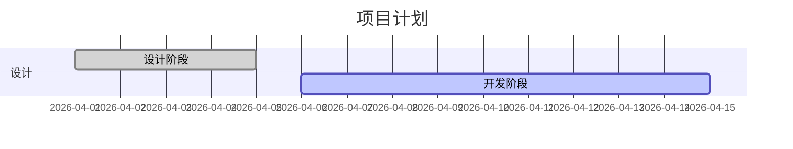

# Mermaid 测试

## 流程图

```mermaid
graph TD;
    A[开始] --> B{判断条件};
    B -->|是| C[执行操作1];
    B -->|否| D[执行操作2];
    C --> E[结束];
    D --> E;
```

## 时序图

```mermaid
sequenceDiagram
    participant U as 用户
    participant S as 服务器
    U->>S: 请求
    S-->>U: 响应
```

## 甘特图

```mermaid
gantt
    title 项目计划
    dateFormat YYYY-MM-DD
    section 设计
    设计阶段: done, des1, 2026-04-01, 2026-04-05
    开发阶段: active, dev1, 2026-04-06, 2026-04-15
```
